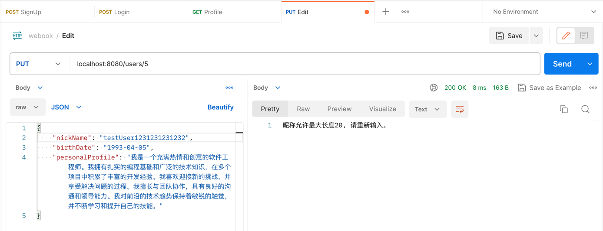
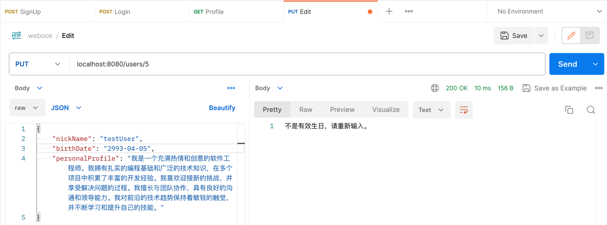
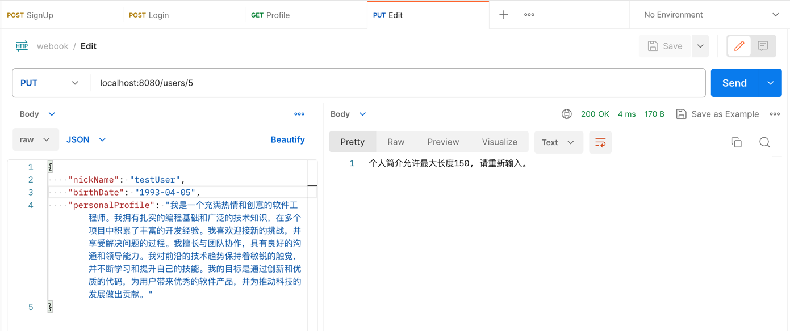
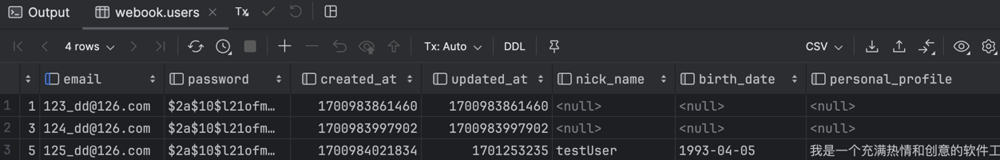
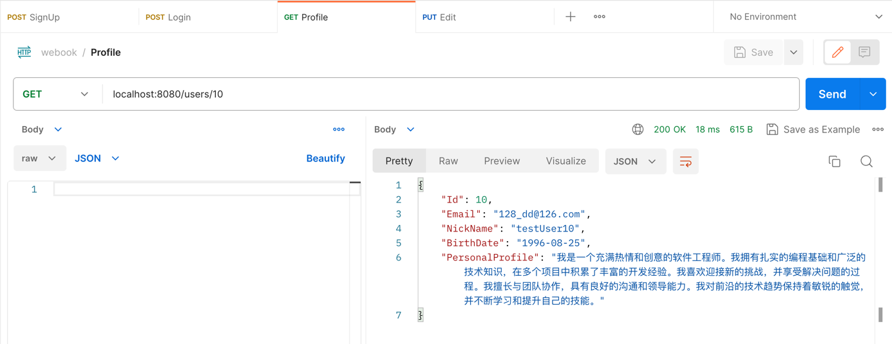
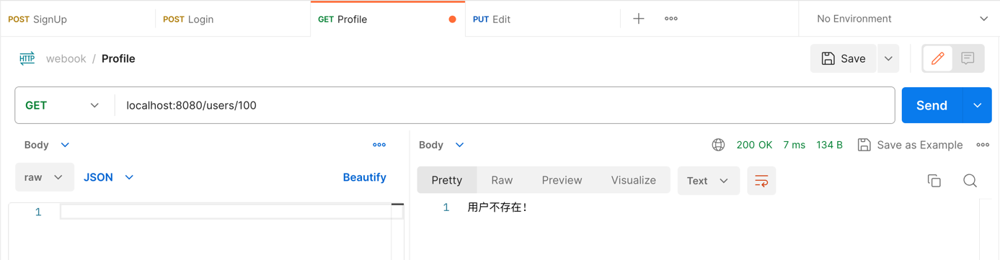

# Homework Screenshot
## Edit - PUT /users/:id
- 个人昵称长度超出20限制
  
- 生日格式不正确
  
  
- 个人简介长度超出150限制
  
- 成功编辑后返回完整的个人信息
  
  
## Profile - GET /users/:id
- 通过存在的ID获取用户profile
  
- 通过不存在的ID获取用户profile
  