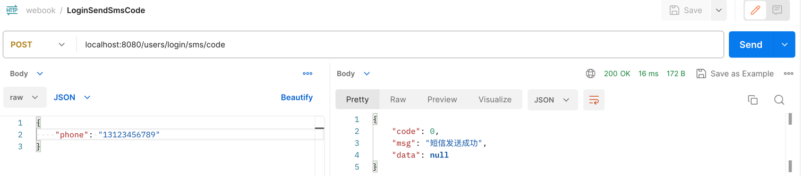
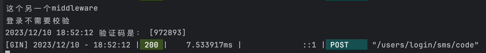
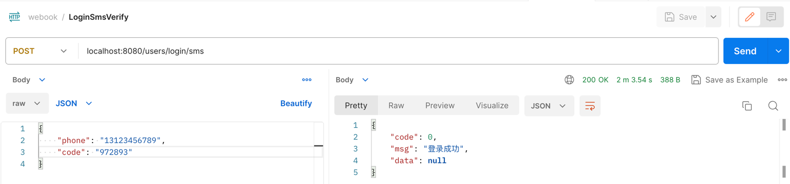
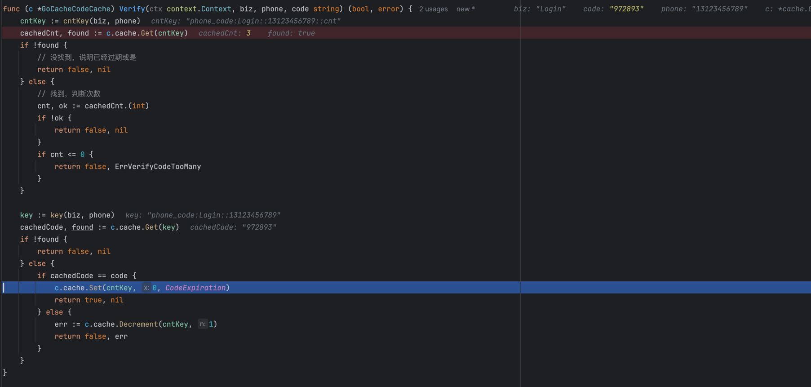
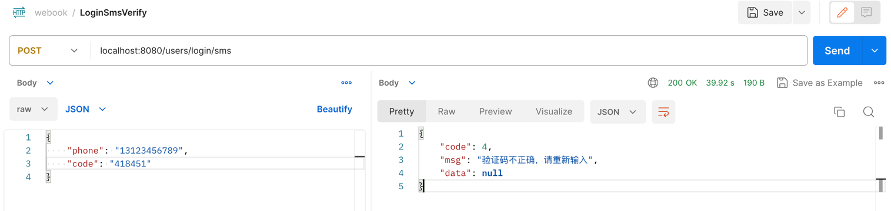
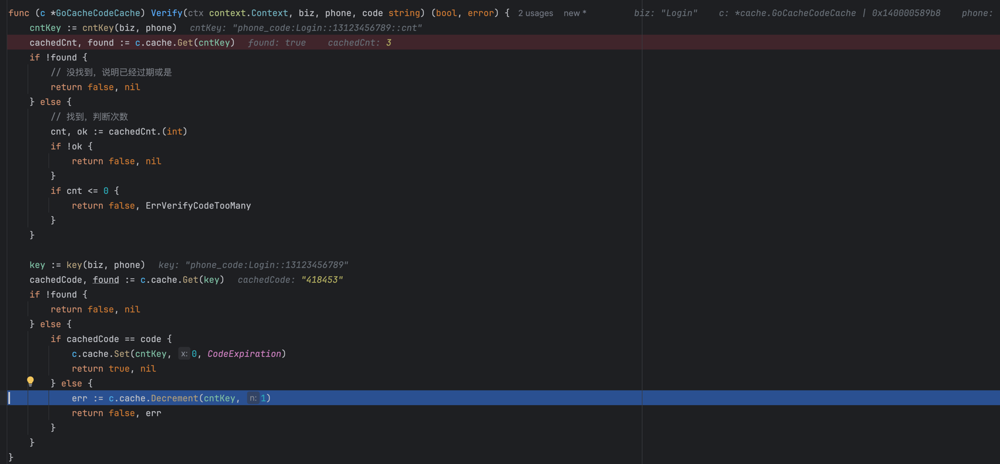
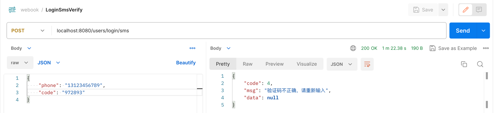
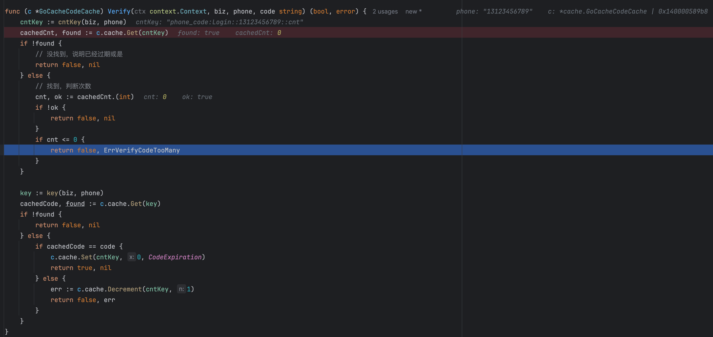

# Homework Screenshot
## Code Changes
- 选用go-cache作为本地缓存, go-cache本身是线程安全的
- cache/code.go 增加GoCacheCodeCache，并实现Send和Verify方法
- cache/code.go 增加NewGoCacheCodeCache方法，使用cache.NewGoCacheCodeCache替换wire.go中的cache.NewRedisCodeCache

### Go Local Cache Comparison
| **Name**                                          | **Description**                                                                                                                         |
|---------------------------------------------------|-----------------------------------------------------------------------------------------------------------------------------------------|
| [go-cache](https://github.com/patrickmn/go-cache) | go-cache是一个强大的键值对缓存库，支持设定每个缓存项的过期时间。如果不设定过期时间，缓存项则永不过期。go-cache是线程安全的，支持并发操作。同时，由于go-cache使用Go语言的标准库实现，它不依赖任何第三方库，用户可以很简单地引用和安装go-cache |
| [BigCache](https://github.com/allegro/bigcache)   | BigCache由Allegro创建，专为并发场景设计。它适合在多个Goroutine之间共享缓存。BigCache的特点是分块存储数据，它可以减少内存的使用，并且提高读写数据的效率。 通过这种方式，BigCache可以比较有效地处理很大的数据量和高并发的读写。     |
| [FreeCache](https://github.com/coocood/freecache) | FreeCache是另一个为大规模数据且高并发设计的缓存库。在内部，FreeCache使用了一个环形缓冲区，利用操作系统的页交换（page swapping）机制，使得缓存可以有效地使用内存。FreeCache还提供了一些其他的特性，如缓存项过期、缓存统计信息等。    |

## Send SMS Code
### Postman

### Terminal

## Verify SMS Code Succeed - Has not Verified
### Postman

## GoLand

## Verify SMS Code Failed - Incorrect Code
### Postman

### GoLand

## Verify SMS Code Failed - Has Verified
### Postman

### GoLand

