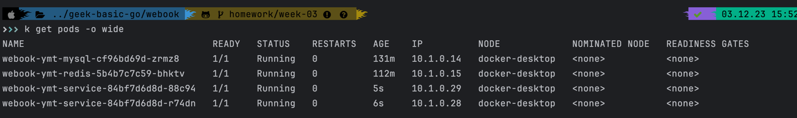

# Homework Week-03 Screen Shots

## kubectl get service 截图

- mysql端口修改为 13316
- redis端口修改为 6380
- webook端口修改为 8090

## kubectl get pods 截图

- webook 修改为2个pod

## webook启动端口修改为8081

## 浏览器访问 /hello，因为没有设置Authorization，所以401

## k8s SignUp

## k8s Login

## k8s Get Profile
