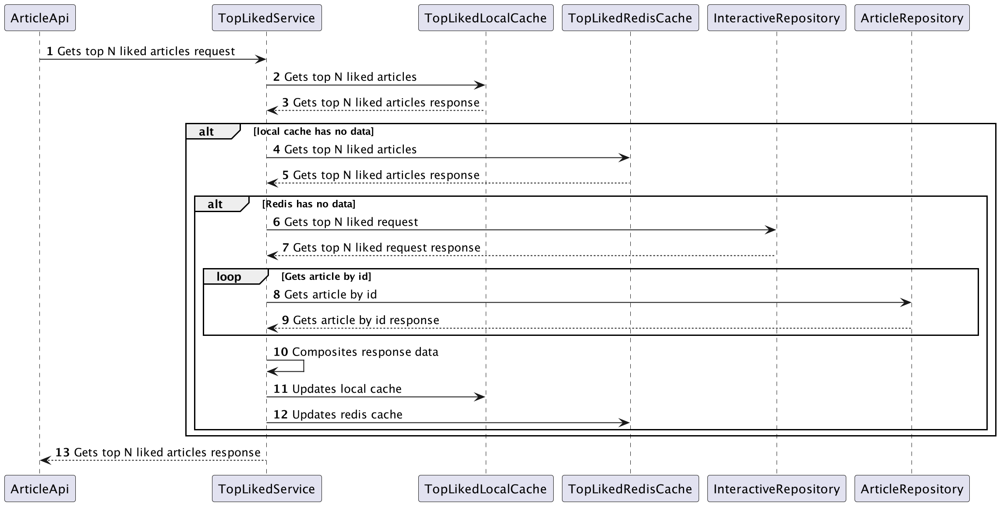

# 找出按照点赞数前N的数据
## 需求
设计一个高性能方案,要求：
1. 综合考虑可以怎么利用缓存，包括 Redis 和本地缓存。要想清楚，你这个缓存方案拿出去面试究竟有没有竞争力，有没有让面试官眼前一亮的点。
2. 允许业务折中，但是你要说清楚你准备怎么折中。

### 需求理解
- 找出所有文章中，点赞数量前N的数据
- 其中N可以设置

## 方案
- 查询interactive表中点赞数前N的数据
- 循环N次，通过article id，查询article表，得到article相关的信息
- 为了提高性能，需要使用缓存的。

### 缓存方案细节
- 使用本地缓存，提供高性能，同时做为Redis缓存未命中情况下的数据降级方案
- 使用Redis做为分布式缓存, 如果缓存未命中，查询数据库
  - 需要加分布式锁，来避免高并发时，缓存穿透，给数据库带来巨大压力甚至压垮
  - 没有拿到分布式锁的线程可以直接返回本地缓存中数据
  - 数据库重新计算top N数据之后，先更新本地缓存，再更新Redis缓存
- 可选，因为需要循环N次去查询article，会比较耗时，可以用定时任务异步处理：
  - 通过定时程序计算数据库点赞前N条数据，并更新Redis缓存，定时任务执行时间可根据产品经理要求设置，如5分钟
  - 如果使用定时任务处理，可以考虑设置Redis缓存数据永不过期

当前方案中，不使用定时任务。

### 业务折中
点赞数并不是核心业务数据，不需要实时进行计算，经过一段时间间隔重新计算前N个点赞的数据，允许缓存和数据库数据不一致。
- 在一段时间间隔内，如果有热点数据点赞数激增或骤减，只会影响这N条数据的最后几条数据，大部分数据顺序变化不会很明显
- 同一个用户在不同的时刻看到的前N个点赞数据可能不一致：属于正常情况，本来经过一段时间点赞数可能会有变化，不影响核心业务
- 不用的用户在同一时刻看到的前N个点赞数据一致
所以，使用缓存提高性能的同时，造成缓存中数据和数据库计算的前N个数据不一致的情况在业务上时可以接受的，需要注意的是缓存的过期时间要和产品经理确定好，设置一个合适的缓存过期时间即可。

### 时序图
#### 缓存命中

#### 缓存未命中

## 核心代码说明

## 性能测试
### 测试机参数

### 测试结果

