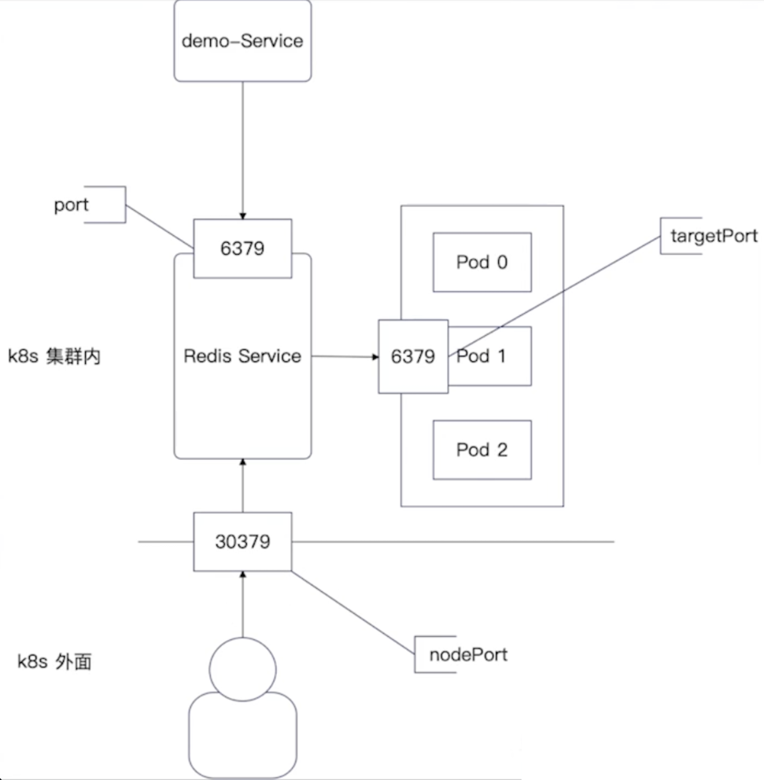
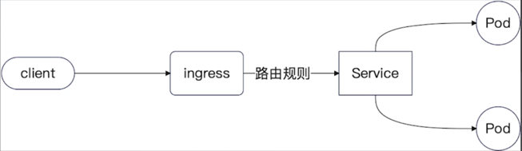
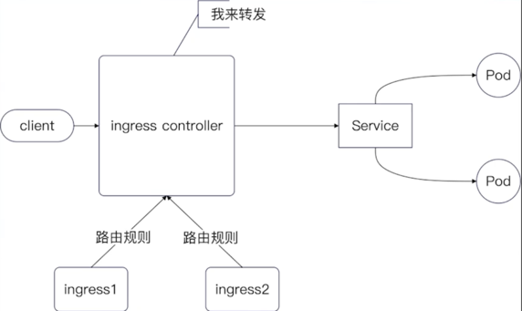

# WeBook

## Project Structure

- **main.go**: 启动webook
- **internal**: 存放所有业务代码
- **internal/web/***: 主要存放web接口
- **pkg**:整个项目沉淀出来可以给别的项目使用的东西
- **domain**: 代表领域对象，业务在系统中的直接反应，可以直接理解为一个业务对象，又或是一个现实对象在中的反应
- **service**: 代表领域服务，代表一个完整的处理过程。组合各种repository，domain，也会组合别的service来共同完成一个业务
- **repository**: 代表领域对象的存储，是一个整体的抽象，只代表数据存储，数据存储有很多，如ES，关系数据库，非关系数据库，甚至文件等
- **repository/dao**: 代表数据库的操作，是操作数据库的抽象

## Notes

- 每次加了go的依赖执行 go mod tidy，确保go.mod和go.sum符合go的规范
- middleware类似于Java web中的filter，interceptor，也叫AOP解决方案
- Docker Compos相关命令
    - docker compose up: 初始化docker-compose并启动
    - docker compose down: 删除docker-compose里边创建的各种容器

## K8s

### ports

### ingress

- ingress代表路由规则
- service中的LoadBalancer强调的是将流量转发到pod上，ingress强调的是发到不同的service上

### Ingress 和 Ingress Controller

- Ingress Controller 可以控制整个集群内部符合条件的所有Ingress
- Ingress是路由配置说明，而Ingress Controller是执行这些配置的

### ingress-nginx

- Ingress的nginx实现

### wire

#### Disadvantage

- 缺乏根据不同环境使用不同实现的能力
- 缺乏根据接口查找实现的能力
- 缺乏根据类型查找所有实现的能力

#### Advantage

- 使代码清晰，可控性强

#### Notes

- 使用wire时初始化方法最好返回接口类型，这样wire可以直接使用类型匹配，不然需要使用wire的Bind方法去绑定
- **但是Go推荐返回具体类型，和wire有冲突**

## Unit Test

- go test xxx_test.go 测试单一文件
- go test . 测试当前目录所有
- go test ./... 当前目录及递归子目录, 常用

### 测试用例定义

- 名字：测试场景
- 预期输入：根据方法参数，接收器设计
- 预期输出
- mock: 每一个测试需要使用到的mock
- 数据准备
- 数据清理

### 运行测试用例

- 调用mock或执行before
- 执行测试方法
- 比较预期结果
- 执行after

### 设计测试用例

- 单元测试：根据代码，最起码做到分支覆盖，覆盖率80%或85%
- 集成测试：根据业务场景，至少覆盖业务主要正常流程和主要异常流程

### Mock Tools

#### gomock

- mockgen: 命令行工具,可以为接口生成mock实现
    - 安装：go install go.uber.org/mock/mockgen@latest
    - go install 会安装到GOPATH/bin
    - 参数：
        - source: 源文件名
        - destination: 目标文件名
        - package: 生成的go文件的package name
    - 根目录下运行
        - mockgen -source=./webook/internal/service/user.go -package=svcmocks
          -destination=./webook/internal/service/mocks/user.mock.go
- 测试中使用控制mock对象的包
- [gomock](https://github.com/uber-go/mock)

#### sqlmock

- [go-sqlmock](https://github.com/DATA-DOG/go-sqlmock)
- 由于dao依赖的gorm.DB和sql driver(sql.go)使用的是结构体，没有接口，所以不能通过gomock进行mock
- 基本用法
    - 用sqlmock创建一个db
    - 设置模拟调用
    - 使用db来测试代码：即本代码中让gorm使用这个db，相当于用的mock的数据库驱动

## Notes

- 识别业务变化点，超前设计但不超前实现
- 识别变化点
    - 任何第三方工具，都存在替换可能
    - 业务流程中不太合理的地方
    - 核心逻辑一定要面向接口编程

## 对于BSON的理解

- E: 一个普通的价值对结构体，value可以是其它三个
- D: E的切片
- M: 一个map，key是string，value可以是任意值
- A: 切片，元素可以是其它三个

## ESR原则

- 创建索引的时候，索引列的顺序遵循Equal, Sort, Range
- ESR的扩展，遵循保持ESR相对顺序不变，E、S、R都可以有N个
- 实践中，有些场景中更换一下S和R的顺序，有可能性能更好

## References

- [kratos](https://go-kratos.dev/en/docs)
- [go-zero](https://go-zero.dev/docs)
- [ekit](https://github.com/ecodeclub/ekit)
- [Tencent SMS](https://cloud.tencent.com/document/product/382/43199)
- [gin](https://github.com/gin-gonic/gin)
- [gorm](https://github.com/go-gorm/gorm)
- [wire](https://github.com/google/wire)
- [gomock](https://github.com/uber-go/mock)
- [go-sqlmock](https://github.com/DATA-DOG/go-sqlmock)
- [viper](https://github.com/spf13/viper)
- [kafka go sdk - sarama](https://github.com/IBM/sarama/)